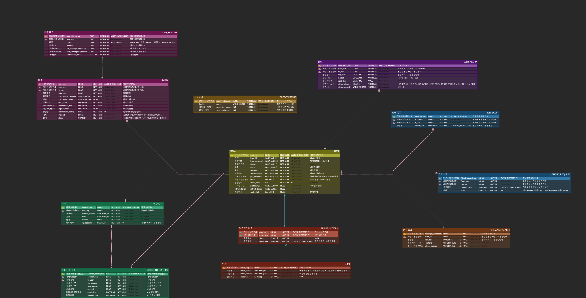

# New Document# SSAFY 공통프로젝트 1주차

### 🖥️ 프로젝트 소개

SSAFY 2학기 특화프로젝트

### 🕰️ 프로젝트 기간

23.08.21 ~ 23.10.06

### 🧑‍🤝‍🧑 멤버 구성

- 김정훈(팀장) : [hunsunsoo](https://github.com/hunsunsoo)
- 김동익 : [DongIkkk](https://github.com/DongIkkk)
- 김동현 : [DongHyun](https://github.com/DongHyun-Klm)
- 김용범 : [KyongBeom](https://github.com/KyongBeom)
- 조해린 : [zosunny](https://github.com/zosunny)
- 최한윤 : [chlgksdbs](https://github.com/chlgksdbs)

### ⚙️ 아키텍쳐 및 기술 소개

<table>
    <tr>
        <td><b>Back-end</b></td>
        <td>

 

</td>
    </tr>
    <tr>
    <td><b>Front-end</b></td>
    <td>

    </td>
    </tr>
    <tr>
    <td><b>Infra</b></td>
    <td>

</td>
    <tr>
    <td><b>Tools</b></td>
    <td>
    
    

    </td>
    </tr>
</table>

<h3><a href="https://glow-composer-ce4.notion.site/1903e0cb7679454795bd1c839ea9f631">팀 노션</a>　|　
<a href="https://www.figma.com/file/VZx8LncxptJFJQy6IIMzbC/Mookup?type=design&node-id=0-1&mode=design&t=wZkhJEew2f24XSPv-0"> FIGMA </a>　|　
<a href="https://www.erdcloud.com/d/zJWJuMyzLAMhEvMce"> erdcloud </a>　|　

### E-R Diagram

